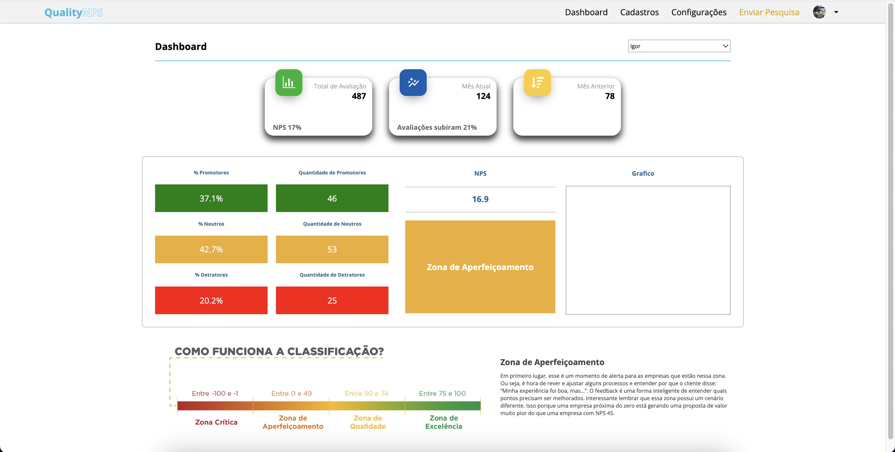

# Quality NPS

# ☕ Descrição do Projeto

Fiz este projeto para um traballho da disciplina de engenharia de software da faculdade, a inteção era apenas ilustrar telas de um sistema, aonde foi feito toda modelagem, cenarios de testes e etc.

## 🤝 Autor

Me chamo Lucas Corrêa, tenho 22 anos, e moro no Rio Grande do Sul.

<table>
  <tr>
    <td align="center">
      <a href="https://www.linkedin.com/in/correalucas0105/">
         
        
            <b>Lucas Corrêa</b>
        
      </a>
    </td>
</table>

OBRIGADO!
